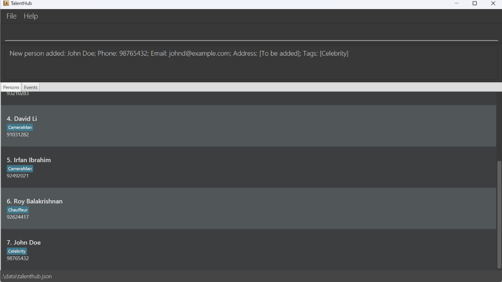
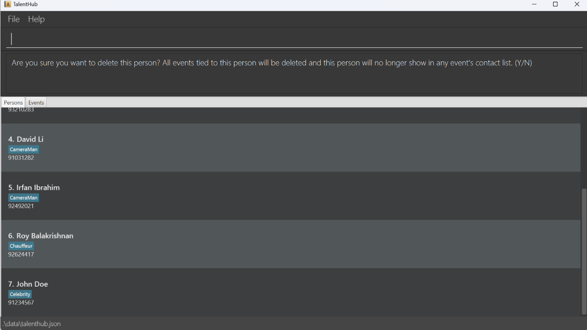
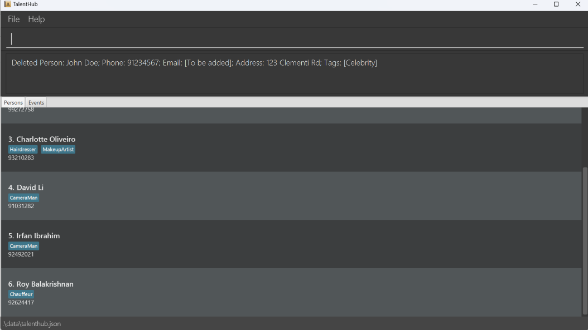
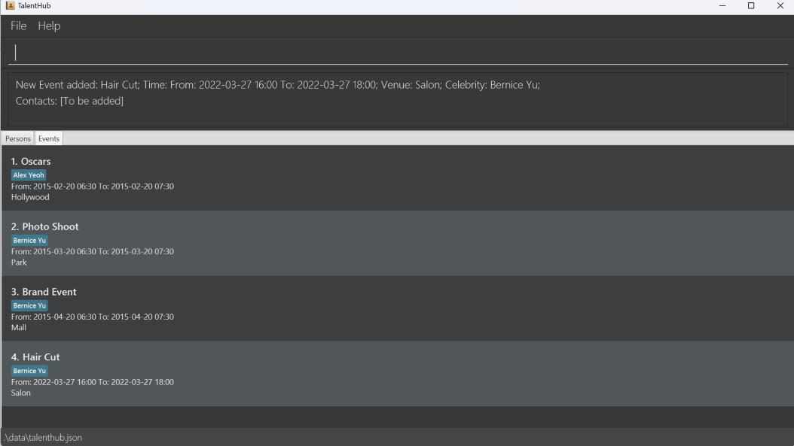
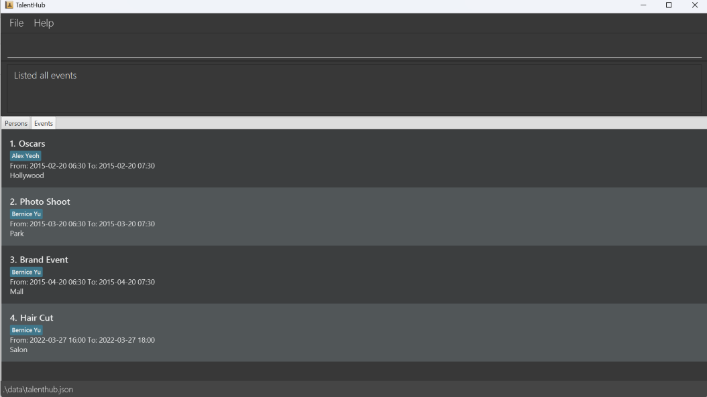
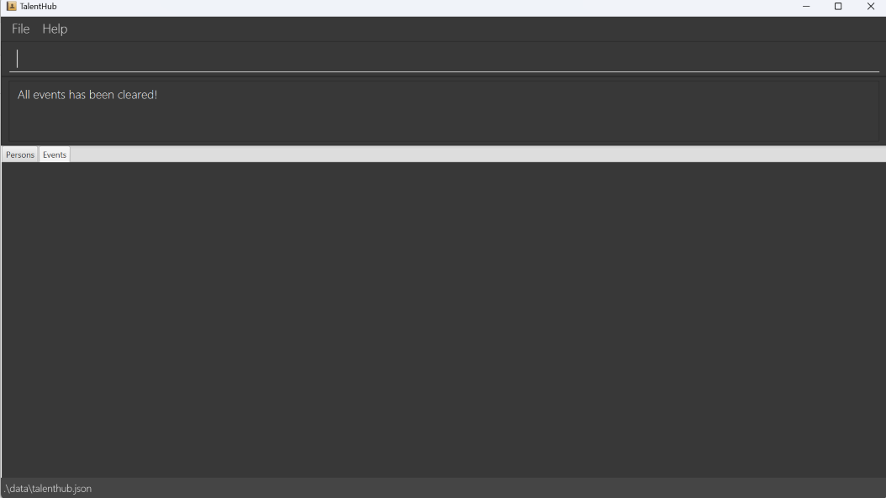
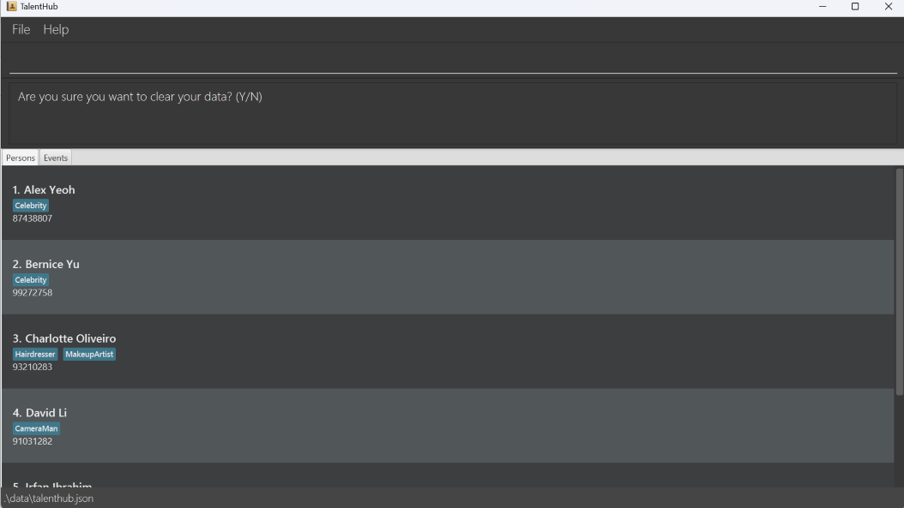
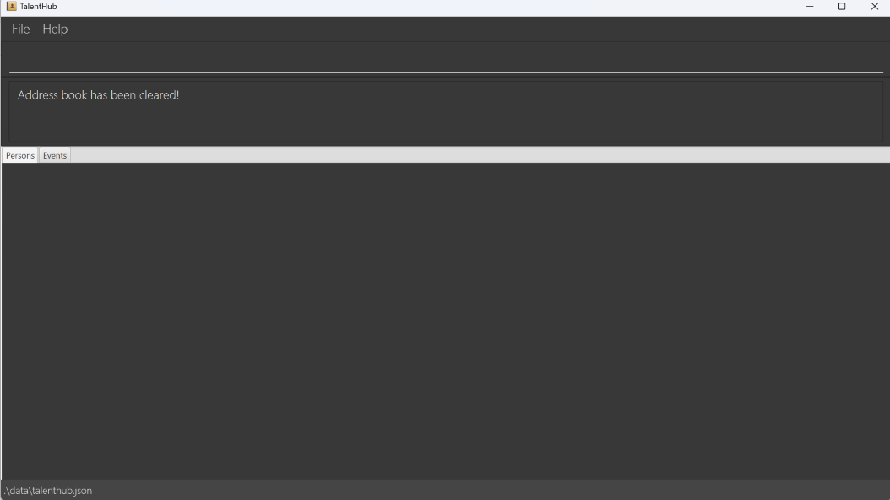

TalentHub is a desktop app designed for **Celebrity Talent Managers**, to help with the **management of celebrity and relevant industrial contacts**.

TalentHub is optimized for use via a **Command Line Interface** (CLI) while still having the benefits of a **Graphical User Interface** (GUI).

**:information_source: CLI and GUI:** 
This means that you can do everything by simply typing commands into the command box, and you can easily view and navigate results on the screen. This way, you can type fast and manage your contacts and your celebrities' events efficiently, while still having the ease of viewing all of them in a graphical format.

If you can type fast, and you need to manage celebrities and their schedules, **TalentHub** is the app for you!

* Table of Contents
{:toc}

---

## Quick start

1. Ensure you have Java `17` or above installed in your computer. You can view an installation guide [here](https://www.oracle.com/java/technologies/javase-jdk17-downloads.html).

2. Download the latest `.jar` file from [here](https://github.com/AY2425S1-CS2103T-W12-4/tp/releases/tag/v1.5).

3. Copy the file to the folder you want to use as the _home folder_ for your TalentHub.

4. Open a command terminal, `cd` to change directory to the folder your TalentHub is in, and use the `java -jar talenthub.jar` command to run the application. 
   A GUI similar to the below should appear in a few seconds. Note how the app contains some sample data. 
   

5. Type the command in the command box and press Enter to execute it. e.g. typing **`help`** and pressing Enter will open the help window. 
   Some example commands you can try:

   - `list person` : Lists all persons.

   - `add person n/John Doe p/98765432 e/johnd@example.com a/John street, block 123, #01-01` : Adds a contact named `John Doe` to TalentHub.

   - `delete person 3` : Deletes the 3rd person shown in the current list after receiving confirmation from you.

   - `clear all` : Deletes all events and persons after receiving confirmation from you.

:warning: **Caution!**  
Running this command will clear all your data in TalentHub. This action is irreversible after confirmation.

  - `exit` : Exits the app.

6. Refer to the [Features](#features) below for details of each command.

---

## Features

**:information_source: Notes about the command format:** 

- Words in `UPPER_CASE` are the parameters to be supplied by the user. 
  e.g. in `add n/NAME`, `NAME` is a parameter which can be used as `add n/John Doe`.

- Items in square brackets are optional. 
  e.g `n/NAME [t/TAG]` can be used as `n/John Doe t/friend` or as `n/John Doe`.

- Items with `…`​ after them can be used multiple times including zero times. 
  e.g. `[t/TAG]…​` can be used as ` ` (i.e. 0 times), `t/friend`, `t/friend t/family` etc.

- Parameters can be in any order. 
  e.g. if the command specifies `n/NAME p/PHONE_NUMBER`, `p/PHONE_NUMBER n/NAME` is also acceptable.

- Extraneous parameters for commands that do not take in parameters (such as `help`, `list`, `exit` and `clear`) will be ignored. 
  e.g. if the command specifies `help 123`, it will be interpreted as `help`.

- If you are using a PDF version of this document, be careful when copying and pasting commands that span multiple lines as space characters surrounding line-breaks may be omitted when copied over to the application.

## Managing Contacts

### Adding a person: `add person`

Adds a person to TalentHub. 

Format: `add person n/NAME p/PHONE_NUMBER [e/EMAIL] [a/ADDRESS] [t/TAG]…​`

**:information_source:Optionals**  

A person can have any number of tags or none at all!
The address and email address fields are also optional! 
Current implementation does not require the person to be added to have the celebrity tag attached to their name.

Examples:

- `add person n/John Doe p/98765432 e/johnd@example.com t/Celebrity` adds a person named `John Doe` with the phone number `98765432`, email address `johnd@example.com` and tag `Celebrity`.

Note that John Doe does not have an address in this example.

- `add person n/Bernice Yu e/berniceyu@example.com a/Yu Apartment p/99272758 t/Hairdresser` adds a person named `Bernice Yu` and the email address `berniceyu@example.com`, address `Yu Apartment`, phone number `99272758` and tag `Hairdresser`.

:bulb: **Tip:** 
You can add the prefixes in any order you want!

### Listing all persons : `list person`

Shows a list of all persons in TalentHub.

Format: `list person`

Example: Calling `list person` would yield the following output

### Editing a person : `edit person`

Edits an existing person in TalentHub.

Format: `edit person INDEX [n/NAME] [p/PHONE] [e/EMAIL] [a/ADDRESS] [t/TAG]…​`

- Edits the person at the specified `INDEX`. The index refers to the index number shown in the displayed person list. The index **must be a positive integer** and smaller than `Integer.MAX_VALUE` e.g. 1, 2, 3, …​
- At least one of the optional fields must be provided.
- Existing values will be updated to the input values.
- When editing tags, the existing tags of the person will be removed i.e adding of tags is not cumulative.

:bulb: **Tip:**
You can delete a person's tags, email or address by leaving their fields empty, like `t/`, `e/` or `a/` respectively!

Examples:

- `edit person 7 p/91234567 e/ a/123 Clementi Rd` Edits the phone number and address of the 7th person to be `91234567` and `123 Clementi Rd` respectively and clears the email address.
- `edit person 2 n/Bernice Yu a/ t/` Edits the name of the 2nd person to be `Bernice Yu` and clears the address and all existing tags.

### Finding persons by name: `find person`

Finds persons whose names contain any of the given keywords.

Format: `find person KEYWORD [MORE_KEYWORDS]`

- The search is case-insensitive. e.g. `hans` will match `Hans`
- The order of the keywords does not matter. e.g. `Hans Bo` will match `Bo Hans`
- Only full words will be matched. e.g. `Han` will not match `Hans`
- Persons matching at least one keyword will be returned (i.e. `OR` search).
  e.g. `Hans Bo` will return `Hans Gruber`, `Bo Yang`
- Exact spacing must be used `Bernice Yu` is not the same as `Bernice  Yu`.

Examples:

- `find person John` returns `john` and `John Doe`
- `find person john bernice` returns `John Doe`, `Bernice Yu`

### Viewing person by name: `view person`

Views the comprehensive details, which includes address and email address, of a specific person
whose name exactly matches the given keywords.

Format: `view person KEYWORD [MORE_KEYWORDS]`

- The search is case-insensitive. e.g. `john` will match `John`
- The order of the keywords matters. e.g. `John Doe` will match `John Doe` but not `Doe John`
- Only the **full name** is searched.
- Only full words will be matched. e.g. `John` will not match `Johnny`
- Persons matching all keywords exactly will be returned. e.g. `John Doe` will return `John Doe`

Examples:

- `view person Bernice Yu` returns the details for `Bernice Yu`
- `view person John Doe` returns the details for `John Doe`

### Filtering person by tag: `filter person`

Filters persons based on the exact tag provided, ensuring only persons with that tag are displayed.

Format: `filter person TAG`

- The search is case-insensitive. e.g. `celebrity` will match `Celebrity`.
- Only exact full-word matches will return a result.
  e.g. `Hair` will return `Hair` but not `Hairdresser`

Examples:

- `filter person Hairdresser` returns the person with tag `HairDresser`.
- `filter person Celebrity` returns the person with tag `Celebrity`.

### Deleting a person : `delete person`

Deletes the specified person from the address book.

Format: `delete person INDEX`

- Deletes the person at the specified `INDEX`.
- The index refers to the index number shown in the displayed person list.
- The index **must be a positive integer** and smaller than `Integer.MAX_VALUE` (2147483647
  ) e.g. 1, 2, 3 …​

:warning: **Caution!**  
When you delete a person, you will also delete events which the person is the celebrity for, and you remove the person from all events' contact lists. This action is irreversible after confirmation.

Examples:

- `list person` followed by `delete person 2` deletes the 2nd person in the address book.
- `find person Bernice` followed by `delete person 1` deletes the 1st person in the results of the `find person` command.

Users will be provided with the following prompt.

Typing `N` or `n` and pressing enter would return the following message.

Typing `Y` or `y` and pressing enter would clear all entries in TalentHub and return the following message.

## Managing Events

### Adding an event: `add event`

Adds an event to TalentHub.

Format: `add event n/NAME t/TIME [v/VENUE] c/CELEBRITY [p/POINTS OF CONTACT]…​`

**:information_source:Optionals**  

An event can have any number of points of contact or none at all!
The venue field is also optional! 
When adding a person to the point of contacts list, only the first tag will be listed in the point of contact list.

Examples:

- `add event n/Oscars t/2022-03-27 10:00 to 2022-03-27 18:00 v/Dolby Theatre c/Alex Yeoh p/Charlotte Oliveiro p/David Li` adds an event named `Oscars` with the time `2022-03-27 10:00 to 2022-03-27 18:00`, venue `Dolby Theatre`, celebrity `Alex Yeoh` and points of contact `Charlotte Oliveiro` and `David Li`.
- `add event n/Hair Cut t/2022-03-27 16:00 to 2022-03-27 18:00 v/Salon for John c/Bernice Yu` adds an event named `Hair Cut` with the time `2022-03-27 16:00 to 2022-03-27 18:00`, venue `Salon for John`, celebrity `Bernice Yu` and no points of contact.

:bulb: **Tip:** 
You can add the prefixes in any order you want!

### Listing all events: `list event`

Shows a list of all events in TalentHub.

Format: `list event`

Example: Calling `list event` would yield the following output

### Editing an event : `edit event`

Edits an existing event in TalentHub.

Format: `edit event INDEX [n/NAME] [t/TIME] [v/VENUE] [c/CELEBRITY] [p/POINTS OF CONTACT]…​`

- Edits the event at the specified `INDEX`. The index refers to the index number shown in the displayed event list. The index **must be a positive integer** and smaller than `Integer.MAX_VALUE` e.g. 1, 2, 3, …​
- At least one of the optional fields must be provided.
- Existing values will be updated to the input values.

:bulb: **Tip:**
You can delete a event's venue or points of contact by leaving their fields empty, like `v/`, `p/` respectively!

  
Examples:

- `edit event 1 t/2024-03-21 v/Jane's Salon` Edits the time and venue of the 1st event to be `2024-03-21` and `Jane's Salon` respectively.
- `edit event 2 n/Movie Screening v/ p/` Edits the name of the 2nd event to be `Movie Screening` and clears the venue and points of contact.

### Finding events by name: `find event`

Finds events whose names contain any of the given keywords.

Format: `find event KEYWORD [MORE_KEYWORDS]`

- The search is case-insensitive. e.g. `hiking` will match `Hiking`
- The order of the keywords does not matter. e.g. `Hair Cut` will match `Cut Hair`
- Only full words will be matched. e.g. `Oscar` will not match `Oscars`
- Persons matching at least one keyword will be returned (i.e. `OR` search).
  e.g. `Hair Hiking` will return `Hair Cut`, `Park Hiking`, `Hiking`

Examples:

- `find event Hiking` returns `Hiking` and `Park Hiking`
- `find event Hair Oscars` returns `Hair Cut`, `Oscars`

### Viewing event by name: `view event`

Views the comprehensive details, which includes points of contact, of a specific event whose
name exactly matches the given keywords.

Format: `view event KEYWORD [MORE_KEYWORDS]`

- The search is case-insensitive. e.g. `hiking` will match `Hiking`
- The order of the keywords matters. e.g. `Hair Cut` will match `Hair Cut` but not `Cut Hair`
- Only the **full name** is searched.
- Only full words will be matched. e.g. `Oscar` will not match `Oscars`.
- Events matching all keywords exactly will be returned.
  e.g. `Hiking` will not match `Park Hiking`

Examples:

- `view event Oscars` returns the details for `Oscars`
- `view event Hair Cut` returns the details for `Hair Cut`

### Filtering events by celebrity name: `filter event`

Filters events based on the exact celebrity name provided,
ensuring that only events associated with that celebrity are displayed.

Format: `filter event CELEBRITY_NAME`

- The search is case-insensitive. e.g. `bernice yu` will match `Bernice Yu`
- The order of the keywords matters. e.g. `Bernice Yu` will not match `Yu Bernice`
- Only the **full celebrity name** is searched.
- Only full name will be matched. e.g. `Ber` will not match `Bernice`
- Persons matching all keywords exactly will be returned.
  e.g. `Bernice` will match `Bernice` but not `Bernice Yu`

Examples:

- `filter event Alex Yeoh` returns the events for celebrity `Alex Yeoh`
- `filter event Bernice Yu` returns the events for celebrity `Bernice Yu`

### Deleting an event : `delete event`

Deletes the specified event from the address book.

Format: `delete event INDEX`
- Deletes the event at the specified `INDEX`.
- The index refers to the index number shown in the displayed event list.
- The index **must be a positive integer** and smaller than or equal to `Integer.MAX_VALUE` (2147483647)
  e.g. 1, 2, 3, …​

  :bulb: **Tip:**
  If you would like to delete all events at once, you can use the <a href="#clearing-all-events--clear-event">clear event</a> command.

Examples:

- `list event` followed by `delete event 2` deletes the 2nd event in the address book.
- `find event Oscars` followed by `delete event 1` deletes the 1st event in the results of the `find event` command.

### Clearing all events : `clear event`

Clears all event entries from the address book after receiving confirmation from you.

Format: `clear event`

:warning: **Caution!**  
Running this command will clear all events in TalentHub. This action is irreversible after confirmation.

Users will be provided with the following prompt.

Typing `N` or `n` and pressing enter would return the following message.

Typing `Y` or `y` and pressing enter would clear all entries in TalentHub and return the following message.

## Utility Commands

### Clearing all entries : `clear all`

Clears all entries from TalentHub.

:warning: **Caution!**  
Running this command will clear all persons and events in TalentHub. This action is irreversible after confirmation.

Format: `clear all`

Users will be provided with the following prompt.

Typing `N` or `n` and pressing enter would return the following message.

Typing `Y` or `y` and pressing enter would clear all entries in TalentHub and return the following message.

### Exiting the program : `exit`

Exits TalentHub.

Format: `exit`

### More information on Commands : `help`

Provides users with a link to the application's user guide in a new window. This link can be copied using the copy URL button to access
the user guide online.

Format: `help`

Example:

### Saving the data

TalentHub data are saved in the hard disk automatically after any command that changes the data. There is no need to save manually.

### Editing the data file

TalentHub data are saved automatically as a JSON file `[JAR file location]/data/talenthub.json`. Advanced users are welcome to update data directly by editing that data file.

:exclamation: **Caution:**
If your changes to the data file makes its format invalid, TalentHub will discard all data and start with an empty data file at the next run. Hence, it is recommended to take a backup of the file before editing it. 
Furthermore, certain edits can cause TalentHub to behave in unexpected ways (e.g., if a value entered is outside of the acceptable range). Therefore, edit the data file only if you are confident that you can update it correctly.

---

## FAQ

**Q**: How do I transfer my data to another Computer? 
**A**: Install the app in the other computer and overwrite the data file (talent.json) it creates with the file that contains the data of your previous TalentHub home folder.

**Q**: How do I add multiple tags to a contact? 
**A**: When adding a person, use t/TAG multiple times. For example, `add person n/John Doe p/98765432 t/CameraMan t/Producer` will add "CameraMan" and "Producer" as tags.

**Q**: How can I delete an optional field in Person or Event I have added? 
**A**: You can delete the field using the `edit` command by specifying a blank prefix for the field you want to delete. For example, `edit event v/` deletes the venue field.

**Q**: How do I undo a mistake? 
**A**: An update to provide an undo feature is currently in progress.

---

## Known issues

1. **When using multiple screens**, if you move the application to a secondary screen, and later switch to using only the primary screen, the GUI will open off-screen. The remedy is to delete the `preferences.json` file created by the application before running the application again.
2. **When editing Person or Event name in View mode**, the Person or Event being viewed will be exited and a blank screen will be displayed. The remedy is to use the `view` command to view the new Contact or Event name.
3. **If you minimize the Help Window** and then run the `help` command (or use the `Help` menu, or the keyboard shortcut `F1`) again, the original Help Window will remain minimized, and no new Help Window will appear. The remedy is to manually restore the minimized Help Window.

---

## Command summary

### Managing Contacts

| Action     | Format                                                                            | Examples                                                                                             |
| ---------- |-----------------------------------------------------------------------------------|------------------------------------------------------------------------------------------------------|
| **Add**    | `add person n/NAME p/PHONE_NUMBER [e/EMAIL] [a/ADDRESS] [t/TAG]…​`             | e.g., `add person n/Jake Doe p/98765432 e/jaked@example.com a/123, Clementi Rd, 1234665 t/Celebrity` |
| **Delete** | `delete person INDEX`                                                          | e.g., `delete person 3`                                                                              |
| **Edit**   | `edit person INDEX [n/NAME] [p/PHONE_NUMBER] [e/EMAIL] [a/ADDRESS] [t/TAG]…​`  | e.g.,`edit person 1 n/James Lee e/jameslee@example.com`                                              |
| **Filter** | `filter person TAG`                                                            | e.g., `filter person Celebrity`                                                                      |
| **Find**   | `find person KEYWORD [MORE_KEYWORDS]`                                          | e.g., `find person James Jake`                                                                       |
| **List**   | `list person`                                                                     |
| **View**   | `view person KEYWORD [MORE_KEYWORDS]`                                          | e.g., `view person Jake Doe`                                                                         |

### Managing Events

| Action     | Format                                                                                  | Examples                                                                               |
| ---------- |-----------------------------------------------------------------------------------------|----------------------------------------------------------------------------------------|
| **Add**    | `add event n/NAME t/TIME [v/VENUE] c/CELEBRITY [p/POINT OF CONTACT]…​`               | e.g., `add event n/Oscars t/2024-03-01 13:10 to 2024-03-01 19:30 v/Dolby Theatre c/Jim Bob p/John Doe, Jane Doe` |
| **Clear** | `clear event`                                                                           |
| **Delete** | `delete event INDEX`                                                                 | e.g., `delete event 3`                                                                 |
| **Edit**   | `edit event INDEX [n/NAME] [t/TIME] [v/VENUE] [c/CELEBRITY] [p/POINTS OF CONTACT]…​`  | e.g.,`edit event 1 t/2024-03-01 13:10 to 2024-03-01 19:30 v/Jane's Salon`                                        |
| **Filter** | `filter event CELEBRITY_NAME`                                                        | e.g., `filter event Jim Bob`                                                           |
| **Find**   | `find event KEYWORD [MORE_KEYWORDS]`                                                 | e.g., `find event Hair Oscars`                                                         |
| **List**   | `list event`                                                                            |
| **View**   | `view event KEYWORD [MORE_KEYWORDS]`                                                 | e.g., `view event Oscars`                                                              |

### Utility Commands

| Action    | Format |
| --------- |----------------|
| **Clear** | `clear all`    |
| **Exit**  | `exit`         |
| **Help**  | `help`         |
